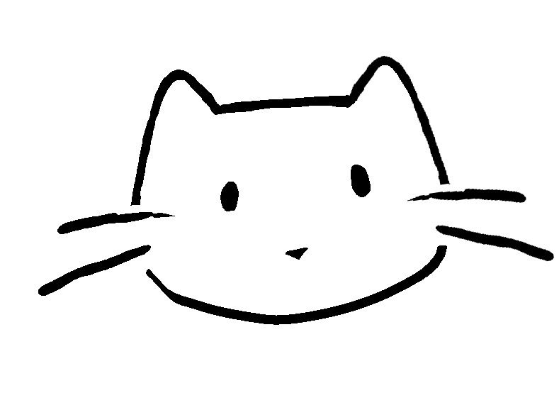
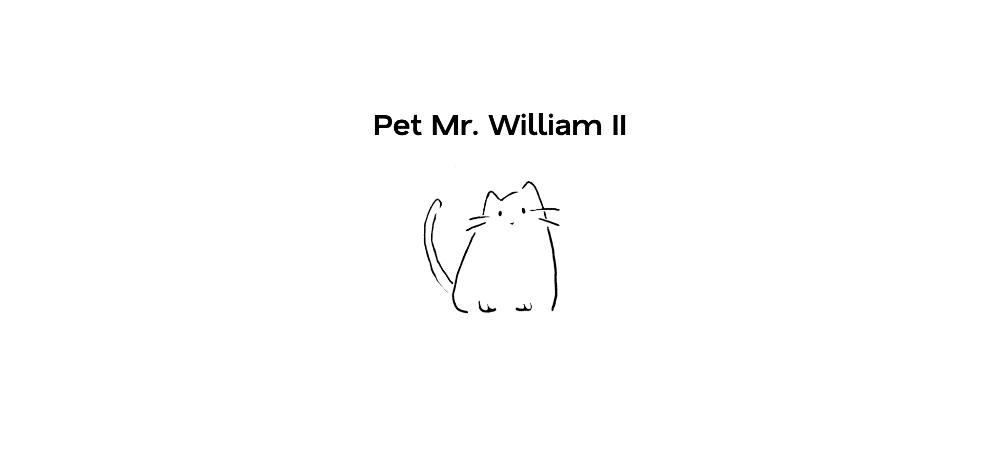

# Cat Simulator

This is a cat simulator website, where you can interact with Mr. William II

## Table of contents

- [Overview](#overview)
  - [The website](#the-website)
  - [Screenshots](#screenshots)
- [Acknowledgments](#acknowledgments)

## Overview

### The website

The user can pet William, but he also should be careful not to annoy him!

### Screenshots

## Acknowledgments

Mr. William II was designed by [JYStoykova24](https://github.com/JYStoykova24)
